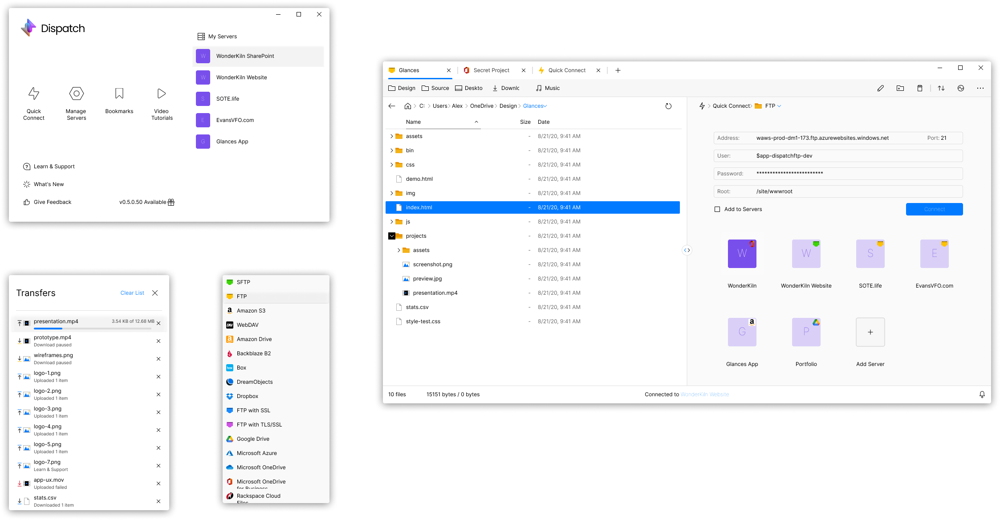

#  Dispatch FTP
FTP Client for Windows; 100% Native from Install to Usage.

## Supported Platforms

Currently the application is developed, tested and currently working on Windows 10/11. Should also work on Windows 7, 8 and 8.1 with .NET Framework 4.5 installed (but was not yet tested).

## Current Status
Dispatch started as a paid FTP client for Windows. We realized this was better fit as a open source project to not only spur more support but also as a legitmate alternative to FileZilla. We are looking at a WinUI v3 redesign are 100% focused on keeping this free and open source.

When a paid scenario does come up, if ever, it will be around 'PowerToys' style enhancements and will only be incorporated if the community agrees.

## Libraries Used

- `ByteSize` (format size in bytes in a human readable form)
- `FluentFTP` (the FTP client library)
- `MSBuildTasks` (manipulate version string on build)
- `Newtonsoft.Json` (parse JSON data)

`Inno Setup` is being used for generating the setup files.

## How to Build

Load the solution in Visual Studio and make sure you restore the NuGet packages before building.

When building in `Release` there is a script that replaces the latest number of the version string (the build number) with the `Revision` environment variables (if there is any). In this way we can automate the distribution of the builds.

The version string looks like this: `MAJOR`.`MINOR`.`PATCH`.`BUILD`.

There are also compiler tags that indicate which channel the app was built on: `NIGHTLY` (or `DEBUG`), `BETA` or `RELEASE`.

## GitHub Actions

There is one GitHub action that distributes the app with these steps:

1. Builds the solution including the build number environment variable & channel compiler tag
2. Creates the executable setup file
3. Uploads the setup to the specific container based on the channel

## Made and Maintained by WonderKiln, Inc.
